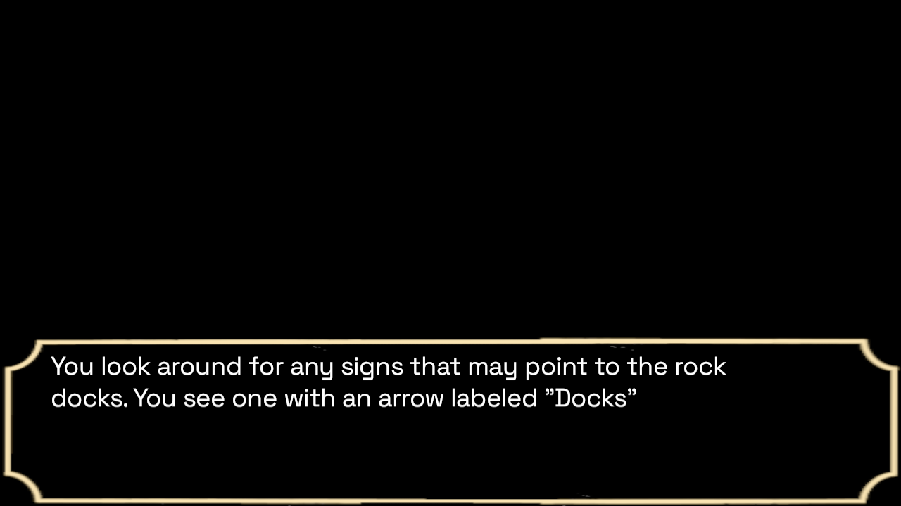

# Prsn

Author: Rafael Rivera

Design: Simple game in a prison where you try to get to an event mentioned at the beginning of the game. It loops if you die (which happens).

Text Drawing: Above the text background layer there is a text layer png that loads as a png. For the sake of simplicity (because that's how I implemented it originally) it writes a text texture to out.png every line, and computes a new one each time you click before updating. It uses harfbuzz and freetype as well as load_save_png. 

Choices: Scripts are stored in the script folder. .txt files link to other .txt files by name, and each "choice" opens a new file. Format is very specific, but can hold as many choices and branches as there is space for .txt files. Currently only handles binary choices but the framework is available such that if I wanted to increase the number of choices I would only have to implement a more robust choosing ui (which I didn't want to to, haha)

Screen Shot:

How To Play: Click to progress text, when you have a choice, W or up for the "Up" option, S or down for the "Down" option

Sources: 
BGM: https://dova-s.jp/bgm/play21182.html (Dova Syndrome hosts a load of royalty-free music)

This game was built with [NEST](NEST.md).

